# Azure Hub-and-Spoke Network Topology

## Architecture Diagram
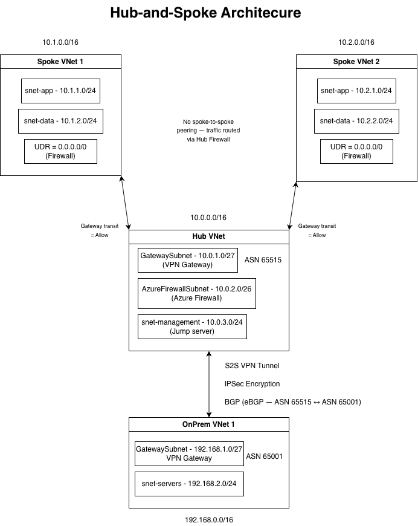

## What This Builds
This project deploys a hub-and-spoke network topology on Azure using Terraform.
It includes one hub VNet, two spoke VNets, VNet peering, a VPN gateway, and a
simulated on-premises network connected via Site-to-Site VPN with BGP enabled.

## Prerequisites
- Azure CLI installed and authenticated (`az login`)
- Terraform installed (v1.0+)
- An active Azure subscription

## Deployment Commands
```bash
terraform init
terraform plan
terraform apply
```

## Architecture Decisions
- **Hub-and-spoke** — centralises shared services and security in the hub
- **BGP over S2S VPN** — dynamic routing between Azure and on-premises
- **VNet Peering** — low latency connectivity between hub and spokes
- **UDRs** — force spoke traffic through hub firewall (commented out — no firewall deployed to minimise cost)

## Screenshots

### All Resources Deployed
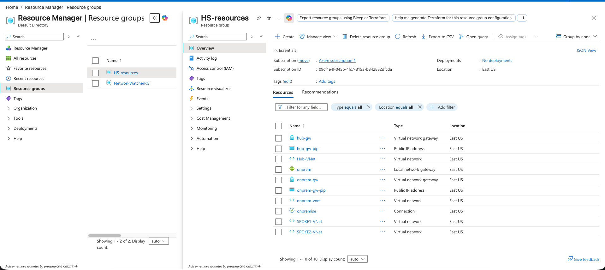

### Hub VNet Overview
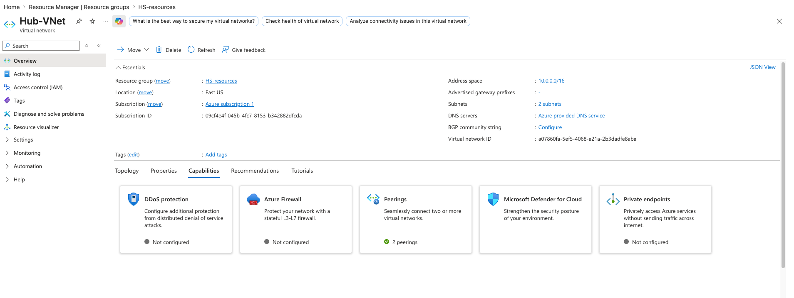

### Hub VNet Subnets
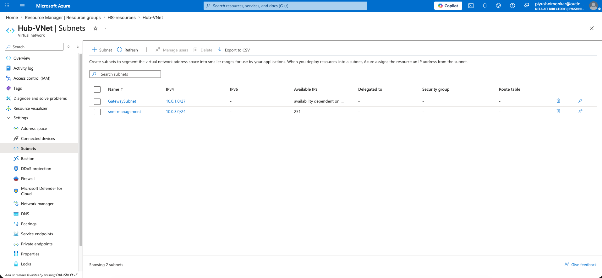

### Hub VNet Peerings
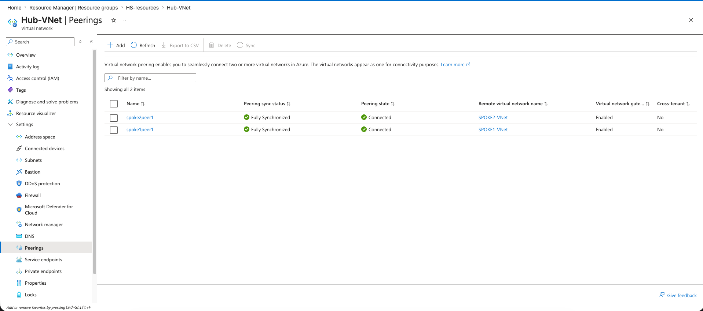

### Spoke2 Peering Detail
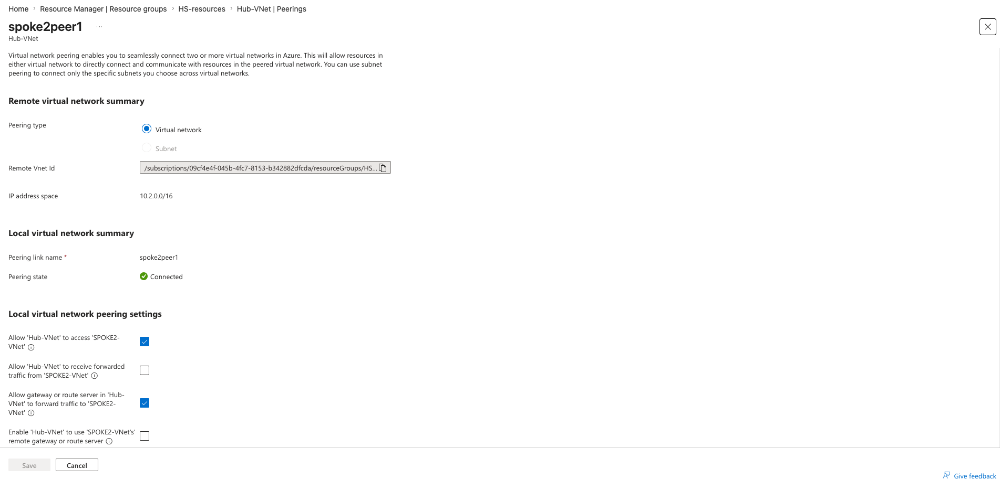

### Spoke1 Peering Detail
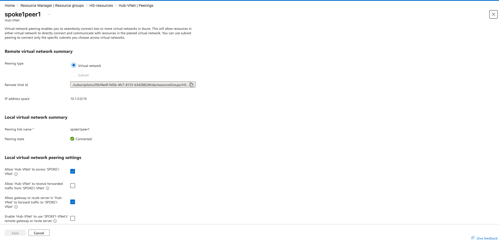

### Hub Gateway Overview
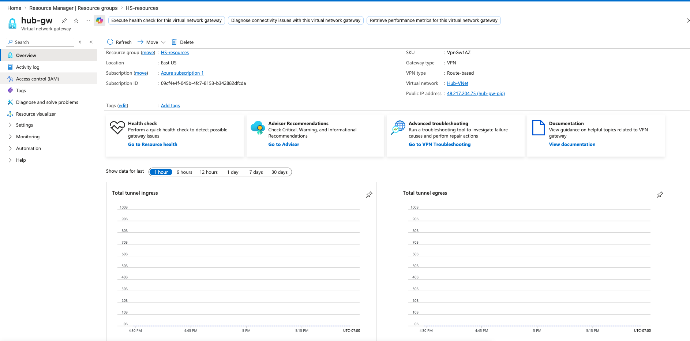

### Hub Gateway Public IP
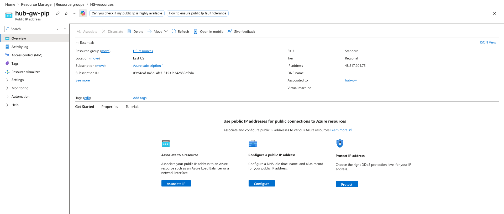

### Local Network Gateway
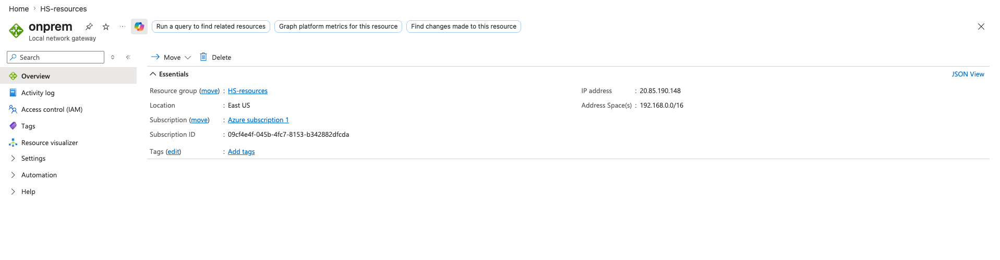

### On-Prem Gateway Overview
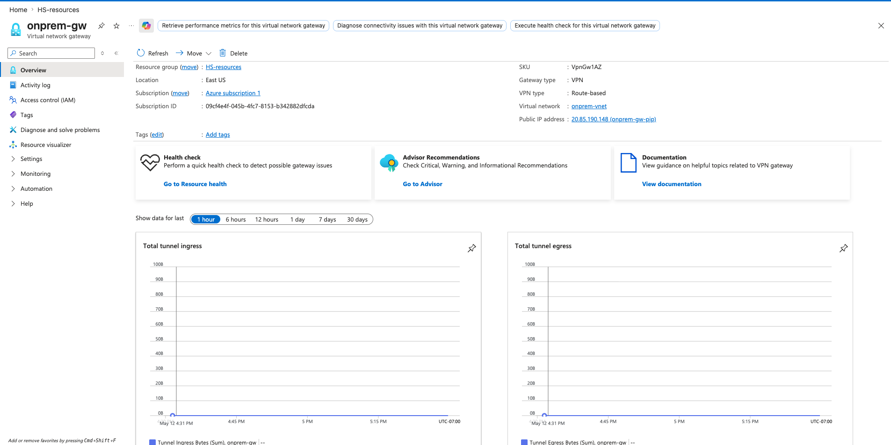

### On-Prem Gateway Public IP
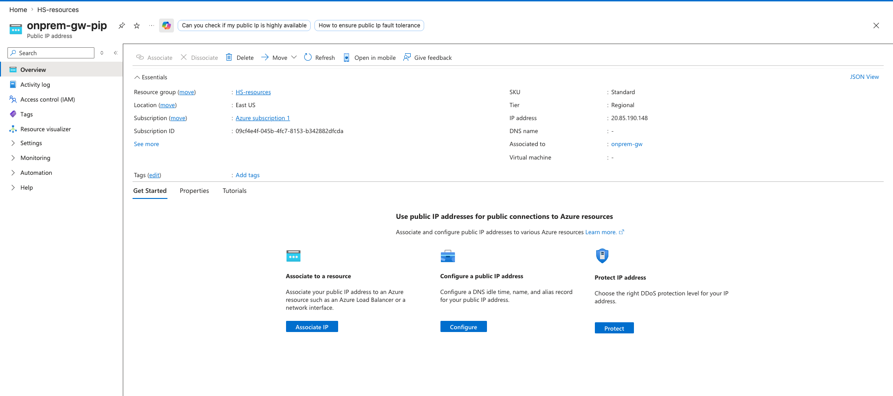

### On-Prem VNet Overview
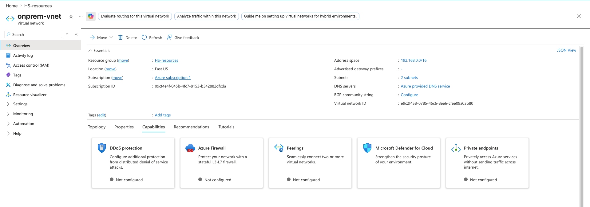

### VPN Connection Detail
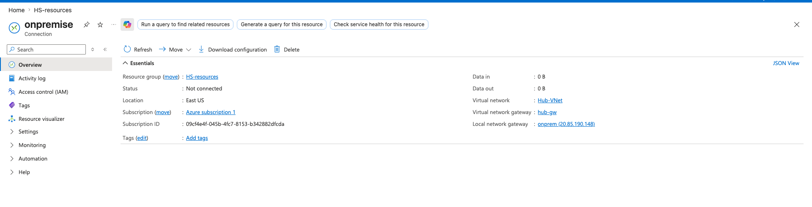

### Spoke1 VNet Overview
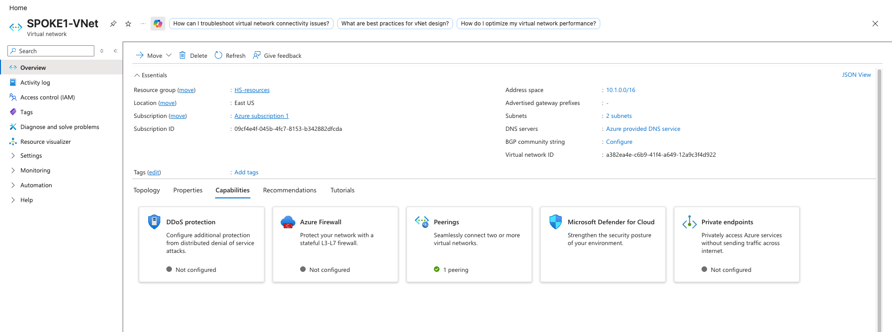

### Spoke1 Peerings
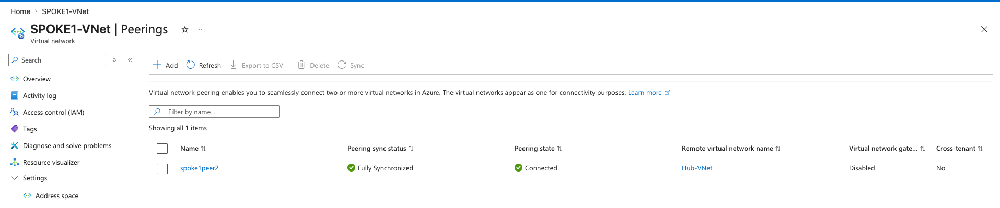

### Spoke1 Peering Detail
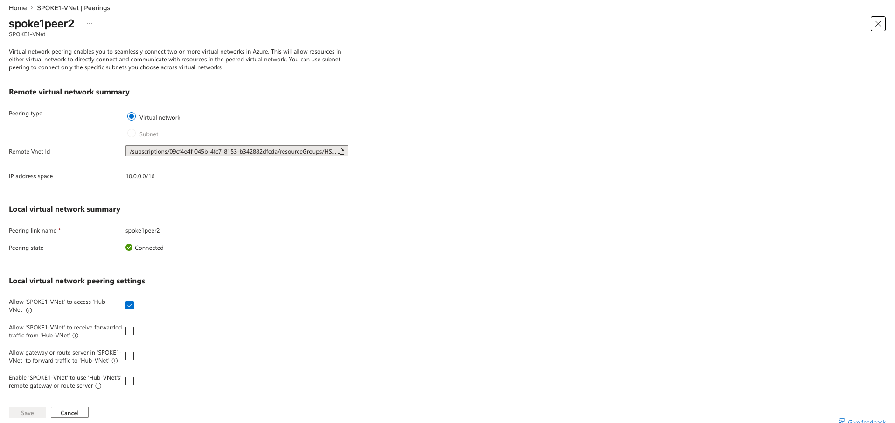

### Spoke2 VNet Overview
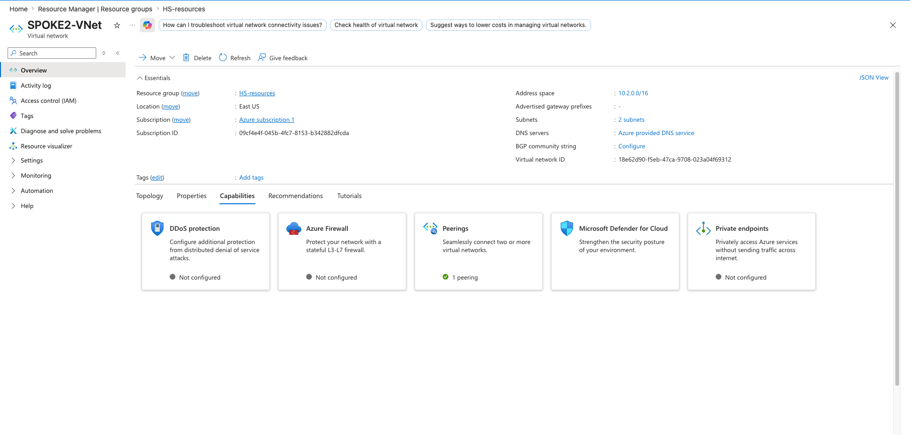

### Spoke2 Peerings
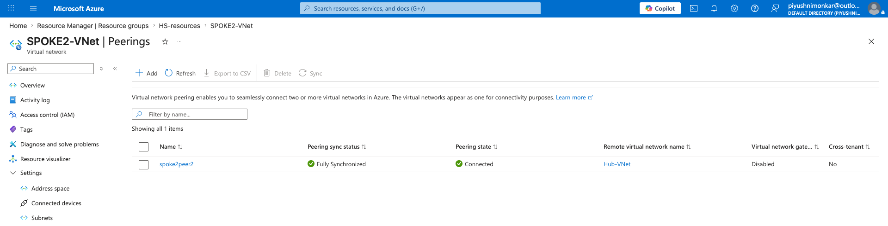

### Spoke2 Peering Detail
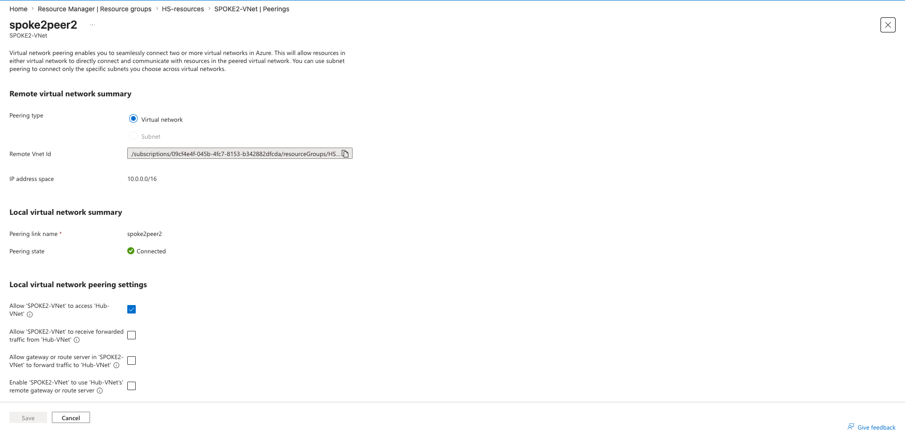


## What I Learned

- **Terraform Modules:** Modules are a reusable way to structure cloud infrastructure code. 
Building them taught me to categorize logic cleanly and use variables to pass information 
between modules, making the code organized and reusable across environments.

- **Precise Referencing in Terraform:** I repeatedly hit errors from referencing wrong 
resource labels — for example using `azurerm_resource_group.example` when the actual label 
was `azurerm_resource_group.rg`. Terraform references must exactly match the label in the 
resource block, otherwise the code fails entirely.

- **Why Hub-and-Spoke:** Hub-and-spoke improves security by centralising a firewall as a 
chokepoint — all traffic is inspected and policies are enforced at one place. It also reduces 
peering complexity significantly. Five spokes connecting directly to each other requires 
5×(5-1)/2 = 10 connections. With a hub you need only 5.

- **UDRs vs VNet Peering:** VNet peering alone allows direct traffic between spokes with no 
inspection. UDRs override that default routing and force all spoke traffic through the hub 
firewall first, where packets are filtered before reaching the destination spoke.

- **VNet Peering vs VPN Tunnel:** VNet peering is a private direct connection between two 
VNets within Azure's backbone — fast and low latency. A VPN tunnel uses IPSec encryption 
over the public internet to connect Azure to external networks such as on-premises data 
centres. In this project, peering connected hub to spokes while the VPN tunnel connected 
Azure to the simulated on-premises network.